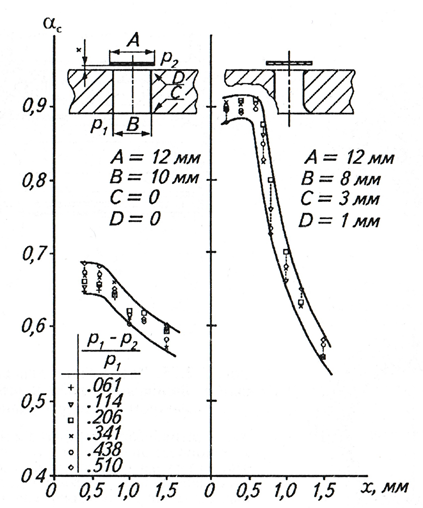

# RingValveCalc

<h3 align="center"> Program for solving dynamics ring valves </h3>

<p align="center"> 
  
</p>

## Overview

<p align="justify"> 
  This project presents a program for the dynamic calculation of the annular valves of a reciprocating compressor
</p>

<h3>Self-acting valve</h3> 

Valves are one of the most critical elements of a reciprocating compressor. They connect and disconnect the working chamber with the suction and discharge cavities, ensuring its tightness during the compression and expansion process, as well as its filling with fresh portions of gas during suction and expelling high-pressure gas into the discharge cavity. Energy losses during gas flow through the valve can reach 30%. For this reason, the correct selection and adjustment of the valve for operation in all compressor modes is very important.

The appearance of the suction ring valve is shown in the visualization below.

<p align="center"> 
  
</p>

<p align="justify"> 
In the saddle and limiter, annular passages are made, which are closed by annular plates. The grooves in the seat are radially offset relative to the grooves in the restrictor to form a gas flow channel during the suction process. In this case, the jumpers in the saddle and the limiter are made opposite each other. The annular plates are spring-loaded and pressed against the seat. At equal pressures on the suction and discharge sides, they close the passage in the valve seat. Springs are made either cylindrical or point. When the pressure from the side of the restrictor is reduced, the gas force presses on the annular plates, and they are pressed against the restrictor, forming a passage in the seat through which the gas enters the working cavity of the reciprocating compressor. When the pressure equalizes, the spring force presses the plate against the seat and the passage in the seat closes.
</p>

<h3>Mathematical model of a self-acting valve</h3> 

<p align="justify"> 
The main task of the theory of valves is to determine the energy losses due to hydraulic resistance, which the valve exerts on the gas flow flowing through it. The cross section of the valve through which the gas flows has a variable area, and depends on the current pressure drop in the working chamber and nozzles. An important indicator for determining losses is the rate of passage of gas through the valve slot. The calculation of the mass flow assumes an adiabatic outflow of gas and occurs according to the Saint-Venant-Wanzel equation. For a real valve, it is written as follows:
</p>

<p align="center"> 
  
</p>

<p align="justify"> 
The defining characteristic of a valve is the equivalent area. The equivalent area of ​​the passage section can be represented as the area of ​​such a hole, the hydraulic resistance of which is absent, and the entire pressure drop in the hole goes to increase the kinetic energy of the gas. To determine the equivalent area, pressure losses in the hydraulic resistance are considered:
</p>

<p align="center"> 
  
</p>

<p align="justify"> 
The dependences of the flow rate used in the developed model are presented below.
</p>

<p align="center"> 
   
</p>

<p align="justify"> 
The mathematical model of the valve is based on the method of N.M. Samsonova, T.F. Kondratieva and M.I. Frenkel based on the works of N.A. Dollezhal. This model has a number of assumptions:
1) The gas flowing through the valve is ideal.
2) No heat exchange with cylinder walls and valve surface.
3) Suction and discharge pressures are constant.
4) The energy of gas movement in the cylinder is not taken into account.

To take into account the movement of the valve plate in the processes of suction and discharge, the equations of the dynamics of the valve plate are derived. In the calculation of ring and disc valves, a single-mass plate system was used. Its diagram and the diagram of the action of forces are shown in the figure below.
</p>

<p align="center"> 
  
</p>

<p align="justify"> 
When compiling systems of equations that describe the operation of a self-acting valve and take into account the dependence of the movement of the shut-off element on time, it is necessary to take into account the impact of the plate on the limiter:
</p>


<p align="center"> 
  
</p>

<p align="justify"> 
The system of equations for the suction valve:
</p>

<p align="center"> 
  
</p>

<h3>Description of the valve design process</h3> 

<p align="justify"> 
To solve the equations, a class structure was created. PistonCompressor - contains the parameters of the compressor and functions for determining the angle of rotation of the shaft, the position of the piston and the parameters for the start of the suction and discharge cycle. Ring - contains parameters of the valve ring plate. RingSuc and RingDis - contain functions for determining valve parameters. DataFrame and ValveMove - designed to store and build calculation results. DiagramFrame - designed to build an indicator diagram based on the results of calculations. SuctionModelRing and DischargeModelRing contain functions that make up the system of equations for the suction and discharge cycle, together with the RingSuc and RingDis objects, represent a mathematical model of self-acting annular valves. Solver is an object that combines all mathematical models into one calculation. Contains algorithms for initial conditions, verification of boundary conditions, calculation progress.
</p>

<p align="center"> 
  
</p>

<p align="justify"> 
The boundary conditions for the rebound of the plate were not specified in the system of equations. Instead, the condition for the collision of the plate with the saddle and the limiter was checked, and the solution was stopped at this moment. After that, a new system of equations was created with initial conditions that take into account the rebound of the plate. This approach ensures the smoothness of the solution in the impact zones of the plate.

The systems were solved using the solve_ivp function of the scipy library. This function numerically integrates a system of ordinary differential equations with a given initial condition. The method used in the calculation, LSODA, is the Adams/BDF method with automatic stiffness determination and switching. It is well suited for solving the systems of equations used, since they contain a conditional, abrupt change in variables. For a smooth solution, it is necessary to set the maximum integration step no more than 1% of half the time of one revolution of the shaft, for fast convergence no more than 0.1% (however, this will increase the time of a couple of iterations).
</p>

## Examples

<p align="justify"> 
Examples of calculating the cycle in the cylinder of a reciprocating compressor with two (different) suction annular valves and two (different) discharge annular valves are shown below. To reproduce these initial calculation data in the application, you must press the button - Sample data.
</p>

<p align="center"> 
  
</p>

<p align="center"> 
 
</p>


## Installation
Clone this repo
```bash
git clone https://github.com/DmitriyKhudiakov/RingValveCalc.git
```
Install libs
```bash
pip install -r requirements.txt
```

## Usage
Run application
```bash
main.py
```


## License
[MIT](https://choosealicense.com/licenses/mit/)
